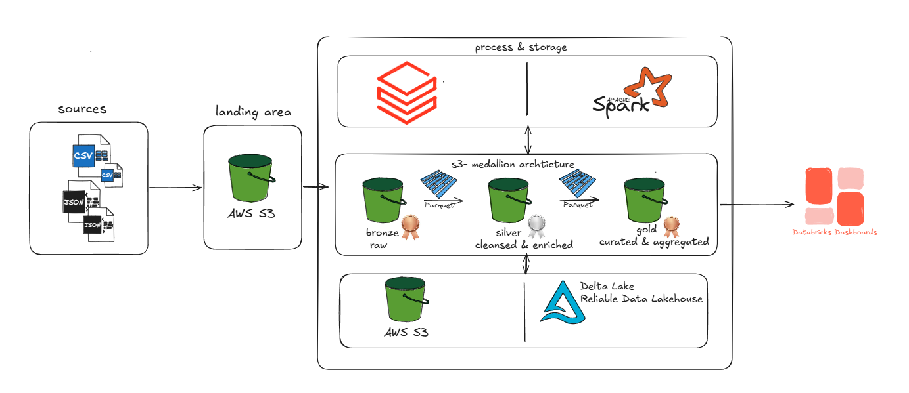
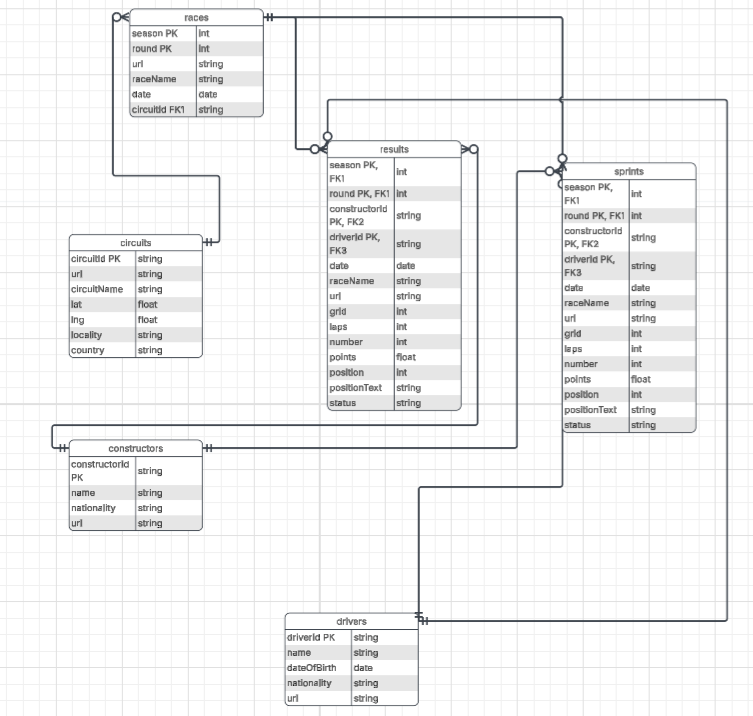
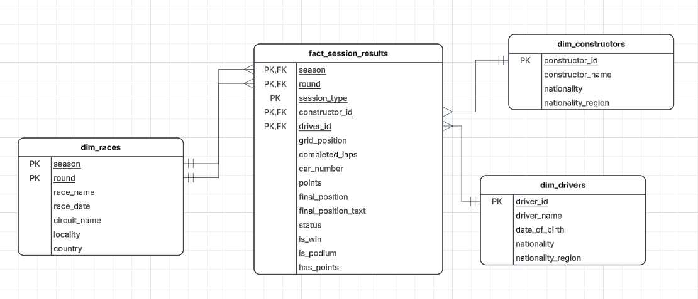
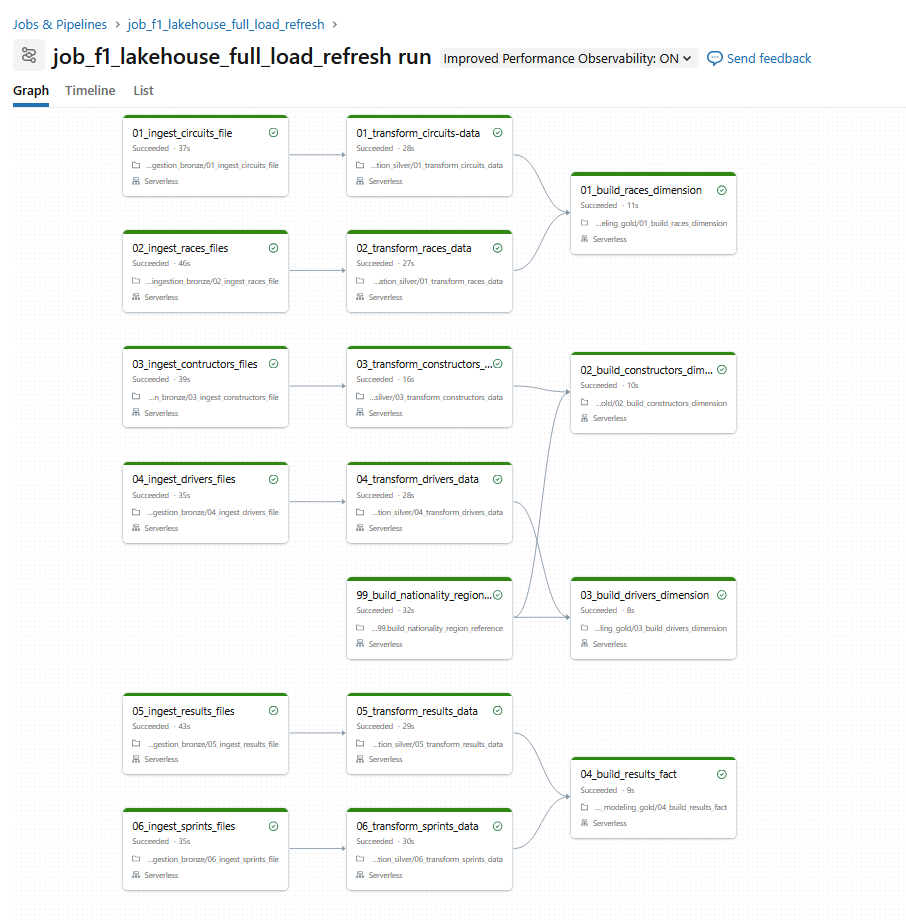
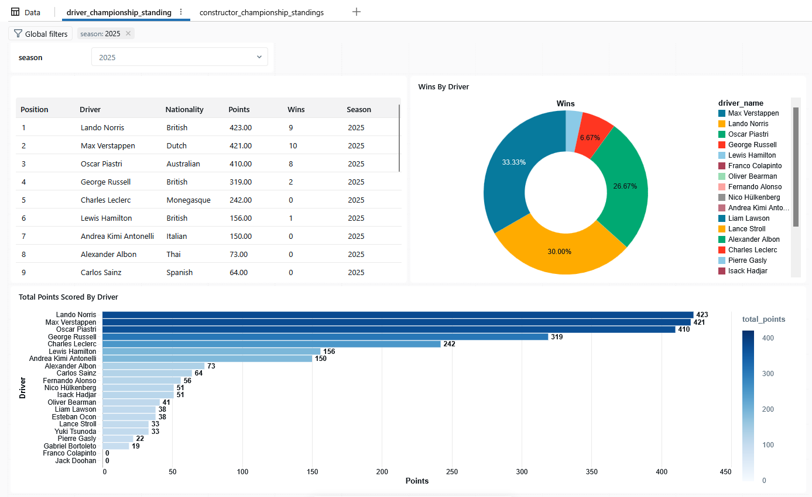

# Formula 1 Data Engineering Project with Databricks & Apache Spark

## Overview

This project implements an end-to-end Data Engineering pipeline for Formula 1 racing data using **Databricks, Apache Spark, Delta Lake, and Unity Catalog**.

The project follows the **Medallion Architecture** to ingest, transform, and organize Formula 1 datasets across Bronze, Silver, and Gold layers, enabling analytical queries and reporting on drivers, constructors, races, and championship standings.

The implementation is based on the hands-on project from the Udemy course **"Azure Databricks & Spark for Data Engineers: Hands-on Project"** by Ramesh Retnasamy.

### Personal Adaptation

Although the original course project uses **Azure Data Lake Storage Gen2**, I adapted the cloud storage layer to use **Amazon S3**.

This required configuring the Databricks environment to access data stored in S3 while keeping the core Spark, Delta Lake, Medallion Architecture, and Unity Catalog concepts of the project.

---

## Architecture

The pipeline follows a Medallion Architecture:



### Main Components

* **Amazon S3** – Cloud object storage
* **Databricks** – Data engineering and analytics platform
* **Apache Spark / PySpark** – Data ingestion and transformation
* **Spark SQL** – SQL-based transformations and analytics
* **Delta Lake** – Transactional storage and data versioning
* **Unity Catalog** – Data governance and organization
* **Lakeflow Jobs** – Workflow orchestration
* **Databricks SQL / Dashboards** – Analytical reporting

---

## Data Pipeline

### Bronze Layer

The Bronze layer ingests Formula 1 datasets from the landing area into Delta tables.

The ingestion process includes:

* Schema definition
* CSV and JSON ingestion
* Ingestion timestamps
* Source file metadata
* Delta table creation
* Reusable ingestion logic

Example datasets include:

* Circuits
* Races
* Constructors
* Drivers
* Results
* Sprint Results

---

### Silver Layer

The Silver layer transforms the raw Bronze data into cleaner and more analytics-ready datasets.

Typical transformations include:

* Data cleaning
* Type casting
* Handling nested structures
* Filtering invalid records
* Joining related datasets
* Standardizing business attributes

---

### Gold Layer

The Gold layer provides business-ready datasets designed for analytics and reporting.

The final data model supports analysis such as:

* Driver standings
* Constructor standings
* Race performance
* Championship results
* Historical Formula 1 analysis

---

## Key Data Engineering Concepts

This project demonstrates practical experience with:

* Data Lakehouse architecture
* Medallion Architecture
* Apache Spark
* PySpark
* Spark SQL
* Delta Lake
* Incremental data processing
* Schema management
* Data transformation
* Data governance with Unity Catalog
* Databricks Jobs / workflow orchestration
* Cloud object storage
* Analytical data modeling

---

## AWS S3 Adaptation

The original project uses Azure Data Lake Storage Gen2 as the cloud storage layer.

For this implementation, I replaced ADLS Gen2 with **Amazon S3**.

This adaptation provided practical experience with:

* S3-based data lake storage
* Databricks integration with AWS storage
* External data locations
* Cloud-based data access
* Authentication and permissions between Databricks and AWS

The main transformation and processing logic continues to run using Apache Spark and Delta Lake.

---

## Project Structure

```text
├── notebooks/
│   ├── 00_setup/
│   ├── 01_bronze/
│   ├── 02_silver/
│   └── 03_gold/
│
├── sql/
│   ├── transformations/
│   └── analytics/
│
├── architecture/
│   └── architecture.png
│
├── screenshots/
│   ├── bronze_tables.png
│   ├── silver_tables.png
│   ├── gold_tables.png
│   ├── workflow.png
│   └── dashboard.png
│
├── .gitignore
├── requirements.txt
└── README.md
```

---

## Example Workflow

1. Store source Formula 1 data in the S3 landing layer.
2. Ingest CSV/JSON data using PySpark.
3. Write raw data into Bronze Delta tables.
4. Clean and transform the data into Silver tables.
5. Build business-ready Gold datasets.
6. Orchestrate the pipeline using Databricks Jobs.
7. Query the Gold layer using Databricks SQL.
8. Visualize the resulting data using dashboards.

---

## Screenshots

### Architecture


### Bronze Layer



### Silver Layer


### Gold Layer



### Workflow



### Dashboard



---

## Technologies

| Technology      | Purpose                             |
| --------------- | ----------------------------------- |
| Python          | Data engineering and transformation |
| PySpark         | Distributed data processing         |
| Spark SQL       | SQL transformations and analytics   |
| Databricks      | Data engineering platform           |
| Delta Lake      | Lakehouse storage layer             |
| Unity Catalog   | Data governance                     |
| Amazon S3       | Cloud object storage                |
| Databricks Jobs | Workflow orchestration              |
| Databricks SQL  | Analytics and reporting             |

---

## What I Learned

Through this project, I gained hands-on experience designing and implementing a modern Data Lakehouse pipeline using Databricks and Apache Spark.

The project strengthened my understanding of:

* Building end-to-end data pipelines
* Spark DataFrame APIs and Spark SQL
* Medallion Architecture
* Delta Lake
* Incremental processing
* Cloud storage integration
* Unity Catalog
* Workflow orchestration
* Data transformation and analytical modeling

I also extended the original Azure-based implementation by adapting the storage layer to **Amazon S3**.

---

## Course Reference

This project was completed as part of the Udemy course:

**Azure Databricks & Spark for Data Engineers: Hands-on Project**
Instructor: Ramesh Retnasamy

Course: https://www.udemy.com/course/azure-databricks-spark-core-for-data-engineers/

The original course project uses Azure services; this repository contains my implementation and AWS S3 adaptation.

---

## Future Improvements

Potential improvements include:

* Adding automated data quality checks
* Implementing CI/CD for Databricks notebooks
* Adding more analytical use cases
* Improving pipeline monitoring and logging
* Introducing automated testing
* Adding infrastructure-as-code for the AWS/Databricks environment

